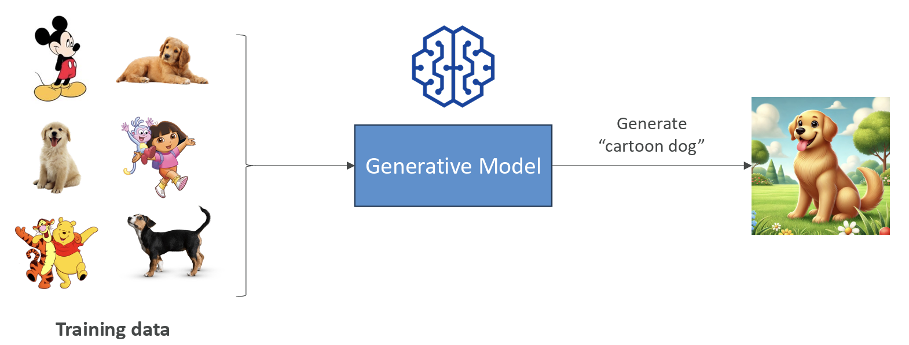
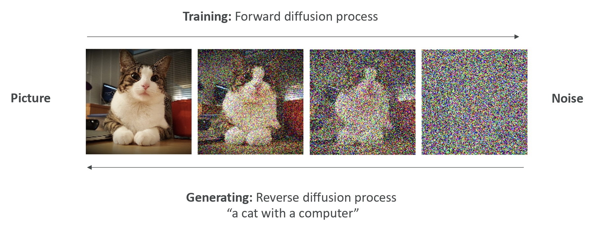
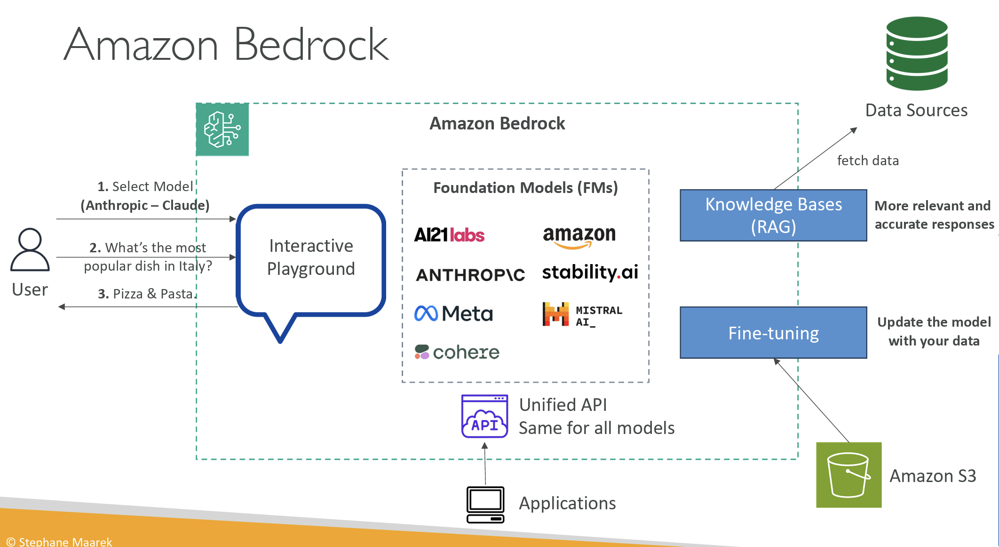
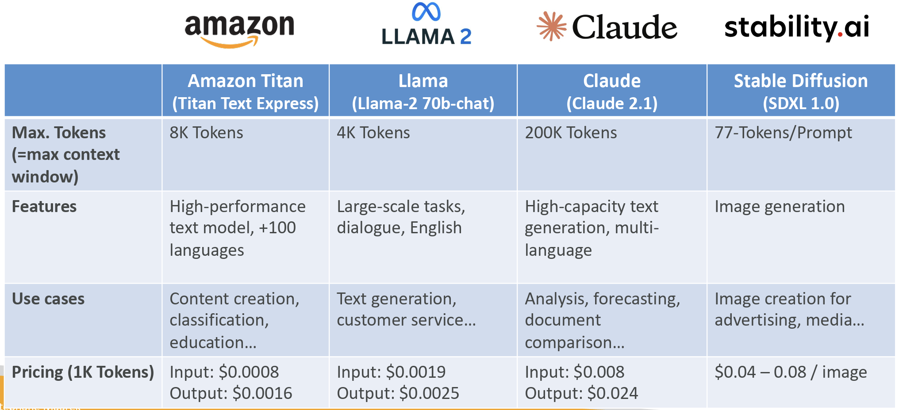
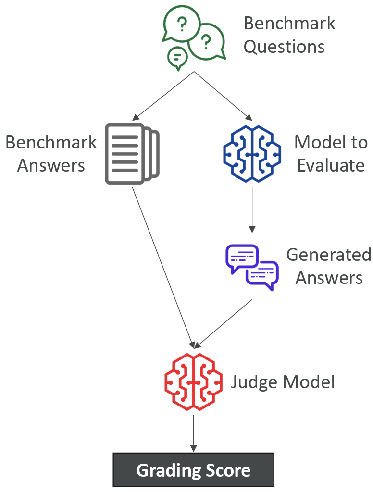
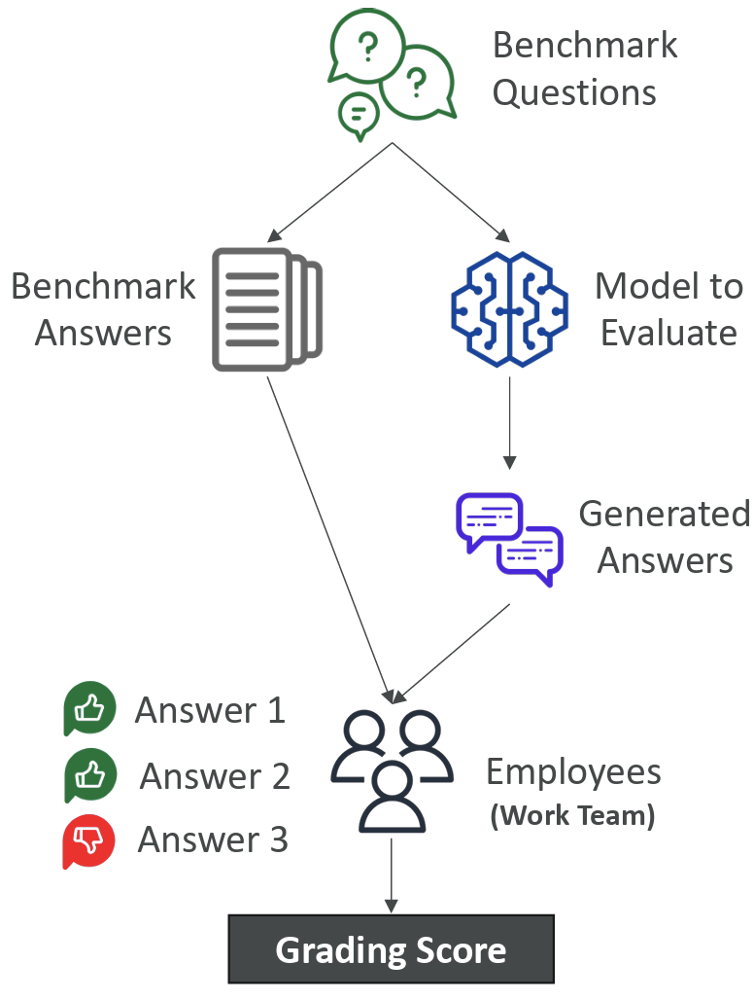

# AWS AI Practitioner certificate

In this markdown file you will find notes taken from the UDEMY class "Ultimate AWS Certified AI practitioner", which you can find [here](https://www.udemy.com/share/10bvuD3@vgoH0K6J6hm6GGtFWY09gUdY3nn03pZ4S8YT3PyYdt85fnAfVMGKZbWYVfkVCJGY/). These are personal notes taken while taking the course, and are meant for reviewing prior to final test taking.

## Section 3: Introduction to AWS and cloud computing

### Regions and services

First off, you need an aws account, you can start one for free and have a 6-month trial and 200 usd in credits.

You have a ton of services available at AWS, but not all services are available on all regions. Make sure that the services you use exist for your region. If you need a service unavailable for your region, select a different region and be done with it.

### Responsibilities

The customer has some responsibilities and AWS has some others. Some of these responsibilities overlap.

The customer is responsible for the security IN THE CLOUD.

AWS is responsible for the security OF THE CLOUD.

### Acceptance use policy

- Can't do illegal, harmful or offensive use of content
- can't do security violations
- Can't do network abuse
- Can't do any email or messages abuse

Pretty obvious rules but legal needs this stated. You can read the whole thing [here](https://aws.amazon.com/aup/).

### Udemy questions:

1. You ONLY want to manage Applications and Data. Which type of Cloud Computing model should you use?

- On-premises -> you manage everything from networking to applications.
- Infrastructure as service IaaS -> you manage the operating system, the middleware, the data and the applications.
- Software as service SaaS -> everything is managed by a 3rd party.
- `Platform as service PasS -> You only manage data and the applications.`

2. What is the pricing model of Cloud Computing?

- Discounts over time
- `Pay-as-you-go pricing -> on cloud computing you are only charged for what you use.`
- pay once a year
- Flat-rate pricing

3. Which Global Infrastructure identity is composed of one or more discrete data centers with redundant power, networking, and connectivity, and are used to deploy infrastructure?

- Edge locations -> edge locations are caching sites to deliver content to end users with lower latency. They are located in availability Zones. They are not used for deployment but for caching content.
- `availability zones -> This is the definition of availability zones`
- regions -> large geographical areas that contain multiple data centers, they are used for geographic organization and data residency purposes. They do not specify the actual physical structures like data centers that form the core of the cloud infrastructure.

4. Which of the following is NOT one of the Five Characteristics of Cloud Computing?

- Rapid elasticity and scalability
- Multi-tenancy and resource pooling
- `Dedicated support agent to help you deploy applications -> in the cloud everything is self service`
- on-demand self service

5. Which are the 3 pricing fundamentals of the AWS Cloud?

- Compute, storage, and data transfer in the AWS cloud -> transfer into the cloud is free or minimal cost.
- compute, networking, and Data transfer out of the AWS cloud -> "networking" is an umbrella that covers data transfer and other network-related configurations, which are handled slightly differently in pricing.
- `Compute, storage, and data transfer out of the AWS cloud -> these are the 3 main pillars of AWS pricing`
- Storage, functions and Data transfer in the AWS cloud. -> "functions" are a specific type of compute resource and not a broad enough category to replace "compute" entirely when discussing fundamental infrastructure components. "Compute" encompasses all processing resources, including virtual machines (EC2), containers, and serverless functions.

6. Which of the following options is NOT a point of consideration when choosing an AWS Region?

- Compliance with data governance - you may have location specific data regulations.
- Latency - you want to be as closes as possible to the end users.
- `Capacity availability - capacity is unlimited in the cloud.`
- Pricing - different regions may have varied costs for compute, storage, and data transfer.

7. Which of the following is NOT an advantage of Cloud Computing?

- train capital expense (CAPEX) for operational expense (OPEX)
- `Train your employees less - you must train your employees so they learn to use the cloud effectively`
- Go global in minutes
- Stop spending money running and maintaining data centers

8. AWS Regions are composed of?

- Two or more edge locations - edge locations are used to distribute content to users
- One or more discrete data centers - they are not physically separate i think
- Three or more availability zones - Regions are made of multiple, isolated, and physically separate Availability zones within the geographic area.

9. Which of the following services has a global scope?

- EC2 - regional service
- `IAM - global service (Identity and access management)`
- Lambda - regional service
- Rekognition - regional service

10. Which of the following is the definition of Cloud Computing?

- Rapidly develop, test, and launch software applications - this is the definition of agility
- automatic and quick ability to acquire resources as you need them and release resources when you no longer need them - This is the definition of elasticity
- `On-demand availability of computer system resources, especially data storage (cloud storage) and computing power, without direct active management by the user`
- Change resource types when needed - this is the definition of flexibility

11. What defines the distribution of responsibilities for security in the AWS Cloud?

- AWS pricing fundamentals -> these describe the 3 fundamentals of the pay-as-you-go model
- `The shared responsibility model`
- AWS acceptance use policy - describes prohibited uses
- The AWS management console - the console allows you to manage services.

12. A company would like to benefit from the advantages of the Public Cloud but would like to keep sensitive assets in its own infrastructure. Which deployment model should the company use?

- Private cloud
- public cloud - using only the public cloud does not allow to keep sensitive assets in your own infrastructure.
- `hybrid cloud - this allows you to benefit from the flexibility, scalability, and on-demand storage access while keeping security and performance in your own infrastructure.`

13. What is NOT authorized to do on AWS according to the AWS Acceptable Use Policy?

- Building a gaming application
- Deploying a website
- `Run analytics on stolen content - you can run analytics, but not on fraudulent content.`
- Backup your data

## Section 5: Amazon bedrock and Generative AI

What is generative AI: is a subset of deep learning. It is used to generate new data that is similar to the data it was trained on... like:

- texts
- image
- audio
- code
- video
- etc etc

The **foundation model** can do a broad range of tasks, like for example, text generation, summarization, info extraction, image genration, chatbot, QnA, etc.

We just feed a ton of data to the foundational model. They need to be trained on a wide variety of input data. It's super expensive because you need a ton of computational power and you need a ton of data.

A few big companies are making these models, like:

- OpenAI: commercial, GPT-4o
- Meta: open source llama model
- Amazon: commercial i think, Nova
- Google: BERT is open source too.
- Anthropic: commercial, claude

these companies have a lot of money and got a lot of resources.

The **LLMs** are a type of AI, relying on a foundation model, designed to generate a **coherent human-like text**.

Like ChatGPT.

They are trained on large amounts of text data. They are trained on a ton of books, articles, websites... they got billions of parameters. Super big models.

It can do language-related tasks such as translation, summarization, etc.

### How do we interact with an LLM?

Why prompts of course!!

When given a prompt the model will leverage all the existing content it has learned to generate new one.

It is non-deterministic, meaning that the same prompt will give different results. Will give similar but not exact answers.

Basically the LLM generates a list of potential words alongside probabilities, so it will try to select from that list of probable words at random.

And it will select that word, update the sentence, and do it over and over again.

#### GenAI images

cou can:

- Give a text prompt to create an image given your request
- Create an image based on another image + a prompt
- Get information from an image given a prompt

#### Diffusion models

You get a picture of a cat, and add a bit of noise again and again, until it looks just like noise. That is called a stable difussion process.

We do that for a lot of pictures, we take a bunch of images and we train the model to create noise outof these pictures.

For the generative portion, we do the opposite, and ask the model to generate an image from noise.

Then the model would just denoise and denoise until it gets a cat out the noise.

### Amazon bedrock

The AWS service we use to build genAI applications.

It's a fully managed service, you don't worry about servers. You just use the service and amazon handles the rest. You keep control of all the data you use to train the model. It's pay-per-use.

To access bedrock and all the foundation models inside it, as well as advanced features...

What type of foundation models we have access to?

- AI21 labs
- Cohere
- Anthropic
- Mistral AI
- stability ai
- amazon models

When you use any of these models, amazon bedrock will make a copy of the foundation model, and in some cases you can further finetune with your own data.

None of your data will be sent back to the providers to train their foundation model.

This is more or less how the service works, you get a playground to develop your llm agent via the foundation model, or adding rag, or actually finetuning of the model, and all is connected the the one API that you can connect to your applications.

The AWS website has a model catalog of all the models you have access to. As of november 2025 there are 252 models in the catalog.

Amazon also has a chat/text playground where you can test a particular model by trying your prompts.

The playground also gives you info like how many tokens came out, the latency, etc.

#### How to choose a model?

There is no clearcut way. Depends on needs, the model's capabilities, constraints, compliance needs, etc.

Maybe you need a multimodal model, like you need text, audio, video together as input.

You need to test

You can use **Amazon titan**, which is a high-performning foundation model from AWS. It can handle image, text, and multimodal choices via the same API from amazon bedrock.

you can also finetune the model with your own data.

Smaller models are more cost effective, but there is unsurprisingly less knowledge base.

In short it's a balancing act.

#### Quick comparison

In general Amazon titan is really cheap, but you need to make sure it works for your needs

In total right now they have about 40 providers.

Amazon **Nova Reel** is a model amazon offers for text or image to video.

On the chat/text playground, you can also try `compare mode` to see side by side two models, and help us decide on which model better suits our needs.

You check:

The cost:

- input tokens
- output tokens
- latency

And the quality of the output by having an actual look at the answer and making a judgement.

### Custom models

We can create our custom models, via the following customization methods:

- finetuning -> you provide labeled data to further finetune the model
- distillation -> you create synthetic data from a large model and use that data to finetune a smaller model.
- continued pre-training -> you use unlabeled data to pretrain a foundation model

The data basically should be stored somewhere on an s3 bucket, where you got one set of training data, and optionally one set of validation data.

You also set up the hyperparameters during finetuning (epochs, batch size, learning rate, warmup steps, etc) to ensure that the custom model is trained the way you want with the performance you want.

The output data is where you want your store your model validation outputs, and you also have to establish whether you want to give bedrock access to write to your s3 or what.

AFter you create the model, you need to pay for its usage. you pay for the `provisioned throughput`.

NOTE: Not all models can be finetuned.

#### Instruction-based fine tuning

This type of tuning uses labeled examples that are prompt-response pairs

You can use this to further train the model on a particular topic and such.

Here you can do:

- Single-turn finetuning: you give it a single turn, with the role, message, content on what you'd expect the bot to reply and get
- multi-turn finetuning: same idea, you feed it multiple turns, so for example this makes a chatbot work better.

#### continued pre-training

This is when you have unlabeled data. Also called a domain-adaptation finetuning so the model is an expert in a specific domain.

For example, you feed the entire documentation of a software so it is now the expert on that software.

It's good for industry-specific stuff like acronyms and such.

#### Notes

You should know that:

- retraining a foundation model requires moneyy.
- instruction-based is cheaper because computations are less intense and you need less data.
- you need an experienced ML engineer to do the task
- You must prepare the data, finetune, and evaluate the model
- Running a finetuned model is more expensive (that provisioned throughput bit).

#### Transfer learning

The main idea is that in this case you reuse a pretrained model for a new related task.

For example, you use claude 3, and do transfer learning to adapt it to a new task.

Very similar to finetuning, but actually it's better for image classification, and NLPs like Bert of GPT.

Actually finetuning is a specific kind of transfer learning.

#### Use Cases

You do this when you want to have a chatbot with a particular persona or tone, or geared for a specific purpose, like customer support and such.

Same if you want to use the most up-to-date information, or if you want to use exclusive data like emails, messages, etc.

Same for when you want to do a super specific task, like classification asessing accuracy.

### Evaluation

You basically need to evaluate the quality of your model via evaluation. You can build your own evaluation prompt, or use one of the default ones available on AWS, and use that to automatically get a score on performance. The way to score can be done with a bunch of different statistical methods.

After all, you want to make sure this model actually works.

#### LLM-as-judge evaluation

The setup needs some ground truth data, and the process looks like this:

You need curated datasets to actually measure performance.

You may need a wide array of topics, complexity, and stuff like that.

And it's helpful to do evaluations because it gives you an idea on how accurate it is, how fast, if it scales, etc.

Some datasets allow you to evaluate bias, so you can see if your model is biased and racist.

Naturally, you can make your own benchmark datasets. But currently there are a bunch of default datasets to benchmark against, and estimate behavior scores.

#### Human evaluation

It's pretty much the same bit, of comparing the benchmark answers against the generated ones from your model. But instead of having an LLM you have a bunch of people doing that evaluation by hand.

You need subject matter experts looking at the answers to actually evaluate given their expertise.

How can humans evaluate? easy:

- thumbs up/thumbs down
- ranking
- literally just a score

The process looks like this:

#### Common metrics

- BLEU -> you evaluate translation. Penalizes for brevity, and looks at combination of n-grams. Slightly more advanced metric.
- ROUGE -> you evaluate summarization and translation services.
  - rouge-n measures the number of matching n-grams between reference and generated text.
  - rouge-l measures the longest common subsequence between reference and generated text.
- BERTscore -> Looks at the semantic similarity between generated text. Basically you compare the meanings of the text. You use a model to compare the embeddings of a text via cosine similarity. Good at nuance.
- Perplexity -> how well the model predicts the next token. Lower is better... if it's confident it's less perplexed.

#### Business metrics

You can also evaluate the performance of a model based on business metrics like:

- user satisfaction
- average revenue per user (revenue per user attributed to genAI)
- cross-domain performance (how good the model was at multitasking)
- conversion rates (generated expected outcomes like purchases)
- efficiency (computation, resources, etc)
